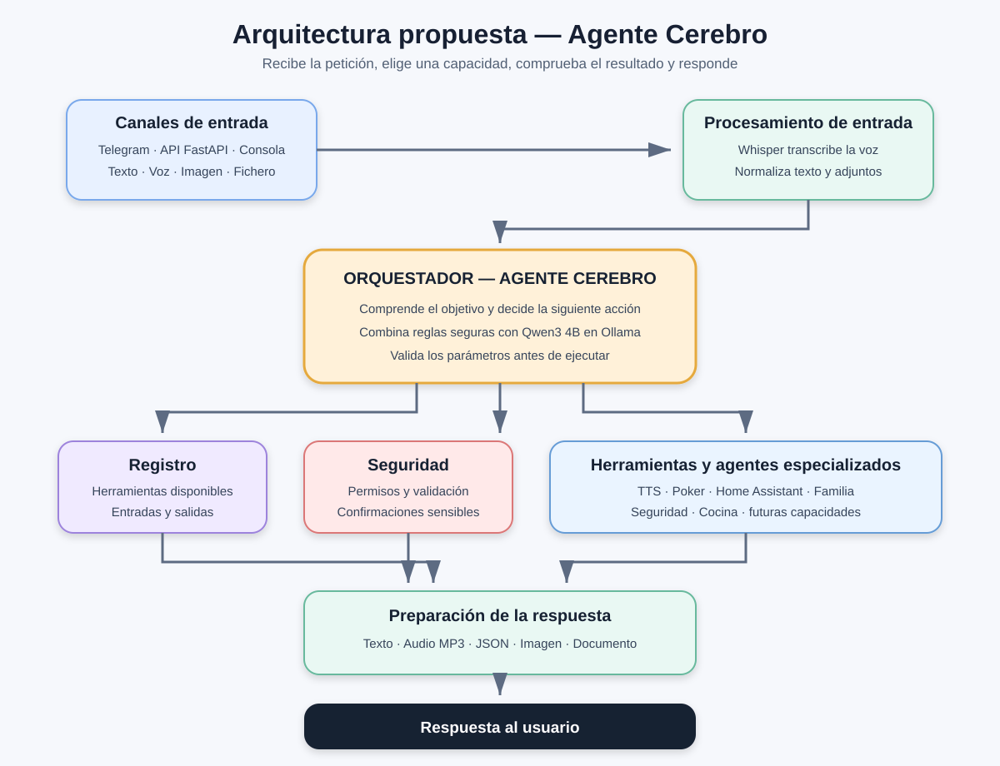

# Agente Cerebro — Arquitectura propuesta

**Fecha de creación:** 22 de agosto de 2026
**Estado:** Diseño inicial
**Objetivo:** Crear un agente general capaz de recibir peticiones, decidir qué componente debe utilizarlas y devolver la respuesta en el formato adecuado.



## Visión general

El **Agente Cerebro** será el punto central de entrada. No realizará personalmente todas las tareas: analizará cada petición y decidirá qué modelo, agente especializado o herramienta debe utilizar.

El funcionamiento general será:

1. Recibir una petición desde Telegram, una API o la consola.
2. Convertirla a un formato común.
3. Determinar qué quiere conseguir el usuario.
4. Elegir la herramienta adecuada.
5. Ejecutar la tarea y comprobar el resultado.
6. Preparar la respuesta como texto, audio, imagen, fichero o JSON.
7. Enviar la respuesta al mismo canal desde el que llegó la petición.

## Componentes

### Canales de entrada

Son las distintas formas de comunicarse con el agente:

- **Telegram:** recibirá mensajes, notas de voz, imágenes y documentos.
- **API FastAPI:** permitirá que Home Assistant y otros programas utilicen el agente.
- **Consola:** permitirá hacer pruebas directamente desde Windows o Ubuntu.

Todos los canales entregarán la petición al Agente Cerebro con la misma estructura interna.

### Procesamiento de entrada

Prepara el contenido antes de que lo analice el orquestador:

- El texto se entrega directamente.
- Las notas de voz se transcriben con **Faster Whisper**.
- Las imágenes y documentos se guardan temporalmente y se identifican.
- Se conservan datos como el usuario, el canal de origen y los archivos adjuntos.

### Orquestador

Es el núcleo del Agente Cerebro. Examina la petición, decide qué acción debe realizarse y coordina los demás componentes.

Primero utilizará reglas claras para las peticiones conocidas. Cuando una petición sea ambigua, podrá consultar el modelo de lenguaje para decidir qué herramienta utilizar.

### Modelo de lenguaje

El modelo de lenguaje interpreta peticiones, redacta respuestas y ayuda al orquestador a elegir una acción.

El modelo inicial será **Qwen3 4B mediante Ollama**, ejecutándose en la VM Ubuntu. OpenAI u otros proveedores podrán añadirse posteriormente como alternativas opcionales.

El modelo propone una acción, pero el programa Python valida sus parámetros antes de ejecutarla.

### Registro de herramientas

Contiene la lista de capacidades disponibles. Cada herramienta declarará:

- Su nombre.
- Para qué sirve.
- Los datos que necesita.
- El resultado que devuelve.
- Su nivel de riesgo.

El orquestador solo podrá ejecutar herramientas registradas.

### Herramientas y agentes especializados

El Agente Cerebro reutilizará componentes existentes y futuros:

- **Texto a voz:** Piper, Kokoro, Qwen3-TTS y OpenAI TTS.
- **Agente Poker:** extraerá datos de capturas y construirá el JSON de la mano.
- **Home Assistant:** consultará entidades y ejecutará servicios autorizados.
- **Agente Familia:** consultará ubicaciones y confirmará llegadas.
- **Agente Seguridad:** evaluará el armado de Alarmo y los sensores.
- **Asistente Cocina:** buscará recetas y gestionará funciones de cocina.

Cada herramienta devolverá un resultado estructurado para que el Agente Cerebro pueda comprobarlo y presentarlo.

### Políticas de seguridad

Impedirán que una decisión del modelo ejecute directamente acciones peligrosas.

- Las consultas se podrán realizar directamente.
- Las acciones domésticas deberán comprobar su resultado.
- Abrir una puerta, desarmar una alarma o eliminar información requerirá reglas adicionales o confirmación explícita.

Estas políticas estarán programadas en Python y no dependerán únicamente del modelo de lenguaje.

### Preparación de la respuesta

Transformará el resultado técnico en una respuesta adecuada para el usuario:

- Texto explicativo.
- JSON estructurado.
- Archivo MP3.
- Imagen o documento.
- Mensaje de error comprensible.

También podrá combinar formatos, por ejemplo enviar en Telegram una respuesta escrita junto con su versión en audio.

### Registro y documentación automática

Cada avance del proyecto se anotará en documentos Markdown dentro de `Agente_Cerebro`.

Los registros deberán indicar como mínimo:

- Fecha.
- Componente afectado.
- Objetivo del cambio.
- Archivos creados o modificados.
- Pruebas realizadas.
- Resultado.
- Problemas pendientes.
- Próximo paso recomendado.

## Estructura inicial prevista

```text
Agentes/
├── Agente_Cerebro/
│   ├── 00_Arquitectura_Propuesta.md
│   ├── imagenes/
│   │   └── arquitectura_propuesta.svg
│   └── avances/
├── common/
├── agente_telegram/
├── agente_poker/
├── agente_familia/
├── agente_seguridad/
└── asistente_cocina/
```

## Decisiones iniciales

- Se utilizará una arquitectura modular.
- El Agente Cerebro coordinará componentes, pero no duplicará su lógica.
- Ollama con Qwen3 4B será inicialmente el modelo local principal.
- Telegram será el primer canal completo.
- Faster Whisper seguirá realizando la transcripción local.
- Los motores de voz se podrán seleccionar mediante configuración.
- Las acciones sensibles estarán protegidas por reglas programadas.
- Cada avance deberá quedar documentado automáticamente en Markdown.

## Próximo paso

Definir el sistema de documentación automática: nombres de los documentos, plantilla común y función Python que registre cada avance.
