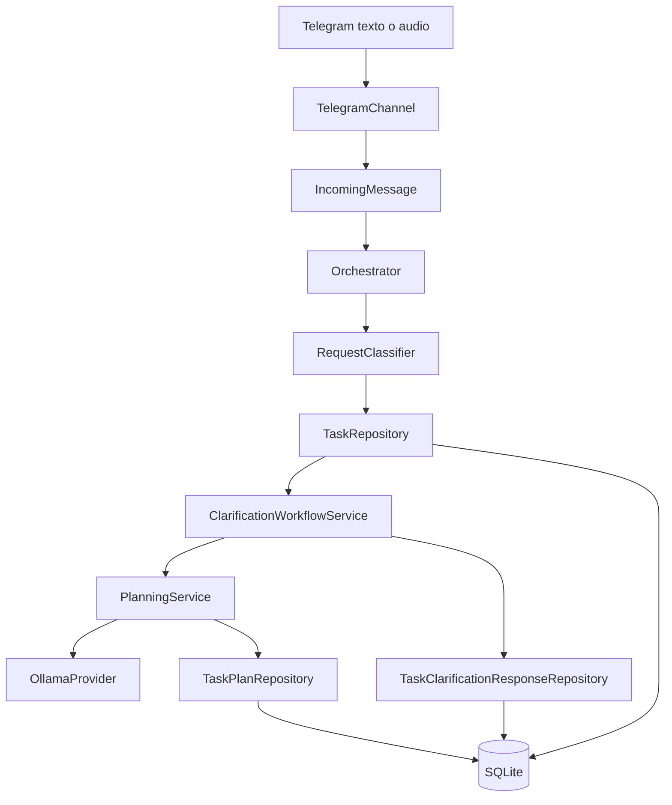

# Hito 7: Planificación iterativa de proyectos desconocidos

**Fecha:** 25 de agosto de 2026
**Proyecto:** Agente Orquestador
**Versión:** 0.1.0
**Estado:** Completado con limitaciones de calidad documentadas

## 1. Objetivo

El objetivo del Hito 7 es permitir que el Agente Orquestador reciba una petición incompleta para crear un proyecto desconocido, solicite aclaraciones, conserve las respuestas, genere una primera planificación técnica y revise esa planificación mediante aclaraciones sucesivas.

El orquestador no debe escribir código durante este hito. Su responsabilidad termina cuando existe un plan versionado, comprensible y pendiente de aclaración o aprobación.

El recorrido general construido es:

```text
Petición inicial
→ clasificación como tarea
→ registro persistente
→ preguntas de aclaración
→ respuesta escrita o hablada
→ planificación técnica
→ almacenamiento de la versión
→ nuevas decisiones pendientes
→ nueva aclaración
→ nueva versión del plan
```

## 2. Resultado funcional

El Hito 7 permite actualmente:

- Crear una tarea a partir de una petición escrita o hablada.
- Detectar el nombre del proyecto objetivo.
- Diferenciar proyectos conocidos y desconocidos.
- Formular preguntas especializadas para `agente_audioText`.
- Formular preguntas generales para cualquier proyecto desconocido.
- Guardar las tareas en SQLite.
- Guardar cada respuesta de aclaración sin borrar las anteriores.
- Generar planificaciones estructuradas mediante Ollama.
- Guardar varias versiones del plan.
- Marcar versiones anteriores como sustituidas.
- Mostrar tecnologías, interfaces, entradas y salidas.
- Mantener decisiones pendientes.
- Recibir aclaraciones mediante `/responder`.
- Recibir peticiones y aclaraciones mediante notas de voz de Telegram.
- Transcribir audio con Whisper.
- Mostrar modelo y tiempo de ejecución.
- Evitar la escritura de código antes de una autorización posterior.

## 3. Límites del hito

Este hito no implementa todavía:

- Aprobación de planes mediante `/aprobar`.
- Ejecución automática de planes.
- Creación de carpetas o archivos de un proyecto.
- Modificación de repositorios externos.
- Coordinación de agentes especializados.
- Reanudación de una ejecución interrumpida.
- Validación semántica completa de contradicciones entre requisitos confirmados y planes generados.

Estas capacidades deberán abordarse en hitos posteriores.

## 4. Situación inicial

El Hito 6 dejó terminada la clasificación y el enrutamiento de peticiones.

Una petición como:

```text
Crea el proyecto agente_audioText
```

se clasificaba como:

```text
kind = task
project_name = agente_audioText
confidence = 0.90
```

El manejador provisional registraba la tarea, pero todavía no existían:

- Estados completos de planificación.
- Respuestas de aclaración persistentes.
- Planes estructurados.
- Versionado de planes.
- Comando `/responder`.
- Entrada mediante audio en el Agente Orquestador.

El Hito 6 terminó con 106 pruebas superadas.

## 5. Principio arquitectónico

Los canales externos no deben modificar la lógica del cerebro.

Telegram convierte cualquier entrada en un contrato común:

```text
Telegram texto ─┐
                ├→ IncomingMessage → Orchestrator
Telegram audio ─┘
```

Una nota de voz no se trata como una herramienta. Es otro modo de entrada al mismo orquestador.

La transcripción se realiza en el adaptador Telegram y el núcleo recibe texto normalizado.

## 6. Arquitectura final del Hito 7



## 7. Estructura incorporada

```text
agente_orquestador/
├── app/
│   ├── audio/
│   │   ├── __init__.py
│   │   └── transcription_service.py
│   ├── context/
│   │   ├── task_clarification_response_repository.py
│   │   ├── task_plan_repository.py
│   │   └── task_repository.py
│   ├── planning/
│   │   ├── __init__.py
│   │   ├── clarification_workflow.py
│   │   ├── formatter.py
│   │   ├── models.py
│   │   ├── prompt_builder.py
│   │   └── service.py
│   └── tasks/
│       ├── __init__.py
│       ├── clarification_analyzer.py
│       ├── clarification_response.py
│       ├── models.py
│       └── state_machine.py
└── tests/
    ├── test_clarification_workflow.py
    ├── test_planning_formatter.py
    ├── test_planning_models.py
    ├── test_planning_prompt_builder.py
    ├── test_planning_service.py
    ├── test_respond_command.py
    ├── test_task_clarification_analyzer.py
    ├── test_task_clarification_response.py
    ├── test_task_clarification_response_repository.py
    ├── test_task_models.py
    ├── test_task_plan_repository.py
    ├── test_task_repository.py
    ├── test_task_state_machine.py
    ├── test_telegram_voice_input.py
    └── test_transcription_service.py
```

## 8. Modelo de tarea

`TaskRecord` representa una tarea persistente.

Información principal:

- Identificador de tarea.
- Proyecto del Agente Orquestador al que pertenece.
- Sesión de Telegram.
- Mensaje que originó la tarea.
- Título.
- Descripción.
- Proyecto objetivo.
- Estado.
- Información pendiente.
- Plan provisional resumido.
- Fechas de creación, actualización, autorización y finalización.

### 8.1 Estados de tarea

```text
pending_clarification
pending_planning
pending_approval
approved
cancelled
in_progress
completed
failed
```

### 8.2 Significado

| Estado | Significado |
|---|---|
| `pending_clarification` | Faltan decisiones del usuario |
| `pending_planning` | La información puede convertirse en plan |
| `pending_approval` | Existe un plan sin decisiones bloqueantes |
| `approved` | El usuario autorizó el plan |
| `cancelled` | La tarea fue cancelada |
| `in_progress` | La ejecución ha comenzado |
| `completed` | La tarea terminó correctamente |
| `failed` | La tarea terminó con error |

### 8.3 Máquina de estados

Las transiciones permitidas se validan mediante `TaskStateMachine`.

```text
pending_planning
├→ pending_clarification
├→ pending_approval
├→ cancelled
└→ failed

pending_clarification
├→ pending_planning
├→ cancelled
└→ failed

pending_approval
├→ approved
└→ cancelled

approved
├→ in_progress
└→ cancelled

in_progress
├→ completed
├→ failed
└→ cancelled
```

Los estados terminales no permiten nuevas transiciones.

## 9. Persistencia SQLite

Durante el Hito 7 el esquema evolucionó hasta la versión 5.

### 9.1 Versión 3: tareas

Se añadió la tabla `tasks`.

```sql
CREATE TABLE IF NOT EXISTS tasks (
    id INTEGER PRIMARY KEY AUTOINCREMENT,
    project_id INTEGER NOT NULL,
    session_id INTEGER NOT NULL,
    source_message_id TEXT NOT NULL,
    title TEXT NOT NULL,
    description TEXT NOT NULL,
    target_project_name TEXT,
    status TEXT NOT NULL DEFAULT 'pending_planning',
    missing_information_json TEXT NOT NULL DEFAULT '[]',
    plan_json TEXT NOT NULL DEFAULT '[]',
    created_at TEXT NOT NULL,
    updated_at TEXT NOT NULL,
    authorized_at TEXT,
    completed_at TEXT,
    FOREIGN KEY (project_id) REFERENCES projects(id),
    FOREIGN KEY (session_id) REFERENCES sessions(id),
    UNIQUE (session_id, source_message_id)
);
```

La restricción de unicidad evita registrar dos veces la misma actualización de Telegram.

### 9.2 Versión 4: respuestas de aclaración

Se añadió `task_clarification_responses`.

```sql
CREATE TABLE IF NOT EXISTS task_clarification_responses (
    id INTEGER PRIMARY KEY AUTOINCREMENT,
    task_id INTEGER NOT NULL,
    response_message_id TEXT NOT NULL,
    questions_json TEXT NOT NULL,
    answer TEXT NOT NULL,
    created_at TEXT NOT NULL,
    FOREIGN KEY (task_id)
        REFERENCES tasks(id)
        ON DELETE CASCADE,
    UNIQUE (task_id, response_message_id)
);
```

Cada respuesta conserva:

- La tarea.
- El mensaje que contiene la respuesta.
- Las preguntas que estaban vigentes.
- La contestación del usuario.
- La fecha.

Guardar la instantánea de las preguntas permite comprender posteriormente qué estaba respondiendo el usuario.

### 9.3 Versión 5: planes versionados

Se añadió `task_plans`.

```sql
CREATE TABLE IF NOT EXISTS task_plans (
    id INTEGER PRIMARY KEY AUTOINCREMENT,
    task_id INTEGER NOT NULL,
    version INTEGER NOT NULL CHECK (version > 0),
    status TEXT NOT NULL DEFAULT 'draft',
    objective TEXT NOT NULL,
    scope_json TEXT NOT NULL DEFAULT '[]',
    technologies_json TEXT NOT NULL DEFAULT '[]',
    interfaces_json TEXT NOT NULL DEFAULT '[]',
    inputs_json TEXT NOT NULL DEFAULT '[]',
    outputs_json TEXT NOT NULL DEFAULT '[]',
    data_entities_json TEXT NOT NULL DEFAULT '[]',
    business_rules_json TEXT NOT NULL DEFAULT '[]',
    phases_json TEXT NOT NULL DEFAULT '[]',
    tests_json TEXT NOT NULL DEFAULT '[]',
    deployment_json TEXT NOT NULL DEFAULT '[]',
    pending_decisions_json TEXT NOT NULL DEFAULT '[]',
    excluded_items_json TEXT NOT NULL DEFAULT '[]',
    completion_criteria_json TEXT NOT NULL DEFAULT '[]',
    created_at TEXT NOT NULL,
    updated_at TEXT NOT NULL,
    FOREIGN KEY (task_id)
        REFERENCES tasks(id)
        ON DELETE CASCADE,
    UNIQUE (task_id, version)
);
```

La migración se comprobó sobre la base real:

```text
Base: C:\Python_Proyectos\Agentes\agente_orquestador\data\context.db
Versión: 5
Tabla task_plans: task_plans
Tareas conservadas: 2
```

La migración mantuvo intactas las tareas existentes.

## 10. Repositorio de tareas

`TaskRepository` permite:

- Crear tareas de forma idempotente.
- Recuperar por identificador.
- Recuperar por mensaje origen.
- Listar por proyecto y estado.
- Registrar información pendiente.
- Volver a planificación.
- Asignar un plan resumido.
- Aprobar y cancelar.
- Validar que la sesión pertenece al proyecto.

Cuando una aclaración ha sido guardada, `return_to_planning()` elimina las preguntas ya contestadas de la tarea:

```python
def return_to_planning(
    self,
    task_id: int,
) -> TaskRecord:
    task = self._get_required(task_id)

    self._state_machine.validate_transition(
        current_status=task.status,
        target_status=TaskStatus.PENDING_PLANNING,
    )

    self._database.connection.execute(
        """
        UPDATE tasks
        SET
            status = ?,
            missing_information_json = '[]',
            updated_at = strftime(
                '%Y-%m-%dT%H:%M:%fZ',
                'now'
            )
        WHERE id = ?
        """,
        (
            TaskStatus.PENDING_PLANNING.value,
            task_id,
        ),
    )

    self._database.connection.commit()
    return self._get_required(task_id)
```

Las preguntas no se pierden porque permanecen en `task_clarification_responses`.

## 11. Contrato de respuesta de aclaración

`TaskClarificationResponse` contiene:

```text
id
task_id
response_message_id
questions
answer
created_at
```

El contrato normaliza espacios y rechaza:

- Identificadores no positivos.
- Mensajes vacíos.
- Preguntas vacías.
- Respuestas vacías.

`TaskClarificationResponseRepository` garantiza idempotencia mediante:

```text
UNIQUE(task_id, response_message_id)
```

## 12. Preguntas especializadas y generales

`TaskClarificationAnalyzer` utiliza dos estrategias.

### 12.1 Perfil especializado de agente_audioText

Pregunta por:

1. Formatos de entrada.
2. Formato de salida.
3. Motor de voz.
4. Canal.
5. Selección de voz.

El analizador busca términos ya presentes para evitar repetir preguntas contestadas en la petición inicial.

### 12.2 Perfil general

Para cualquier proyecto desconocido pregunta:

1. Objetivo principal.
2. Tipo de aplicación.
3. Usuarios.
4. Funcionalidades.
5. Información persistente.
6. Entorno de ejecución y acceso.
7. Restricciones o preferencias tecnológicas.
8. Criterios de finalización.

Este cuestionario no pretende resolver todo el proyecto. Su objetivo es reunir información suficiente para una primera planificación.

Las preguntas posteriores deben surgir de la planificación generada.

## 13. Modelo de planificación

`TaskPlan` contiene:

```text
id
task_id
version
status
objective
scope
technologies
interfaces
inputs
outputs
data_entities
business_rules
phases
tests
deployment
pending_decisions
excluded_items
completion_criteria
created_at
updated_at
```

### 13.1 Estados del plan

```text
draft
pending_clarification
pending_approval
approved
superseded
```

### 13.2 Propiedades calculadas

Un plan requiere aclaraciones cuando contiene decisiones pendientes:

```python
@property
def requires_clarification(self) -> bool:
    return bool(self.pending_decisions)
```

Puede aprobarse cuando no existen decisiones pendientes y dispone de alcance, tecnologías, fases y criterios de finalización:

```python
@property
def can_be_approved(self) -> bool:
    return (
        not self.pending_decisions
        and bool(self.scope)
        and bool(self.technologies)
        and bool(self.phases)
        and bool(self.completion_criteria)
    )
```

## 14. Versionado de planes

`TaskPlanRepository` calcula automáticamente la siguiente versión:

```sql
SELECT COALESCE(MAX(version), 0) + 1 AS next_version
FROM task_plans
WHERE task_id = ?;
```

Antes de insertar la nueva versión marca como `superseded` los planes anteriores que todavía eran borrador, pendientes de aclaración o pendientes de aprobación.

```text
Plan versión 1: superseded
Plan versión 2: pending_clarification
```

Ninguna versión se sobrescribe ni se elimina.

## 15. Constructor del prompt

`PlanningPromptBuilder` entrega al modelo:

- Identificador de tarea.
- Título.
- Proyecto objetivo.
- Descripción inicial.
- Preguntas realizadas.
- Respuestas acumuladas.
- Instrucciones de planificación.
- Esquema JSON obligatorio.

Formato requerido:

```json
{
  "objective": "texto",
  "scope": ["texto"],
  "technologies": ["texto"],
  "interfaces": ["texto"],
  "inputs": ["texto"],
  "outputs": ["texto"],
  "data_entities": ["texto"],
  "business_rules": ["texto"],
  "phases": ["texto"],
  "tests": ["texto"],
  "deployment": ["texto"],
  "pending_decisions": ["texto"],
  "excluded_items": ["texto"],
  "completion_criteria": ["texto"]
}
```

El prompt ordena expresamente:

- Proponer tecnologías concretas.
- Identificar interfaces, entradas y salidas.
- Utilizar las aclaraciones como información confirmada.
- No repetir preguntas contestadas.
- No escribir código.
- No afirmar que se han creado archivos.
- Devolver solamente JSON.

## 16. Servicio de planificación

`PlanningService` realiza este recorrido:

```text
obtener tarea
→ obtener aclaraciones
→ construir prompt
→ llamar LanguageProvider
→ extraer JSON
→ validar campos
→ crear TaskPlan
→ devolver GeneratedPlan
```

`GeneratedPlan` incluye:

```text
plan
model
elapsed_seconds
```

La validación rechaza:

- Respuesta vacía.
- Texto sin objeto JSON.
- JSON inválido.
- Ausencia de objetivo.
- Campos que no sean listas.
- Listas con elementos que no sean textos.

Se admite JSON rodeado accidentalmente por un bloque Markdown, porque el servicio extrae el contenido entre la primera llave de apertura y la última de cierre.

## 17. Flujo de aclaración

`ClarificationWorkflowService` coordina la operación completa:

```text
comprobar tarea
→ comprobar sesión
→ comprobar estado pending_clarification
→ guardar respuesta
→ generar plan
→ volver temporalmente a pending_planning
→ evaluar decisiones pendientes
```

Si el plan contiene decisiones pendientes:

```text
tarea → pending_clarification
```

Si no contiene decisiones pendientes:

```text
tarea → pending_approval
```

El servicio valida que la tarea pertenece a la misma conversación. Un usuario no puede responder desde otra sesión a una tarea ajena.

## 18. Formato de Telegram

`PlanningFormatter` genera una respuesta organizada:

```text
PLAN PROPUESTO — VERSIÓN N

Tarea
Proyecto
Estado

OBJETIVO
ALCANCE FUNCIONAL
TECNOLOGÍAS PROPUESTAS
INTERFACES
ENTRADAS
SALIDAS
ENTIDADES DE DATOS
REGLAS DE NEGOCIO
FASES DE CONSTRUCCIÓN
PRUEBAS PREVISTAS
DESPLIEGUE
ELEMENTOS EXCLUIDOS
CRITERIOS DE FINALIZACIÓN
DECISIONES PENDIENTES
```

Si existen decisiones pendientes muestra:

```text
/responder <id> <tus aclaraciones>
```

Si no existen, indica que la tarea está preparada para solicitar aprobación.

Siempre termina recordando:

```text
No se ha creado ni modificado código del proyecto.
```

## 19. Comando /responder

Formato escrito:

```text
/responder 3 La aplicación utilizará Angular, FastAPI y SQLite.
```

El orquestador valida:

- Presencia del identificador.
- Identificador entero positivo.
- Presencia de la respuesta.
- Existencia de la tarea.
- Pertenencia a la sesión.
- Estado pendiente de aclaración.

Metadatos producidos:

```text
route = clarification_workflow
task_id
task_status
plan_id
plan_version
plan_status
model
elapsed_seconds
```

## 20. Entrada mediante audio

La conversión de audio a texto reutiliza el diseño validado previamente en `agente_ia`.

Se creó:

```text
app/audio/transcription_service.py
```

Configuración:

```dotenv
WHISPER_MODEL=small
```

Dependencia:

```text
faster-whisper
```

### 20.1 Servicio de transcripción

Configuración utilizada:

```text
modelo: small
dispositivo: cpu
compute_type: int8
idioma: es
beam_size: 5
vad_filter: true
```

El modelo se carga de forma diferida en la primera nota de voz y se reutiliza en las siguientes.

### 20.2 Petición normal por audio

```text
Nota de voz
→ descargar OGG
→ transcribir
→ IncomingMessage(TEXT)
→ Orchestrator
```

Ejemplo hablado:

```text
Crea el proyecto puntuacion_padel
```

### 20.3 Aclaración por audio

Primero se selecciona la tarea:

```text
/responder 3
```

Telegram guarda temporalmente:

```text
context.user_data["pending_audio_task_id"] = 3
```

La siguiente nota de voz se transforma internamente en:

```text
/responder 3 <texto transcrito>
```

Esto evita depender de que Whisper convierta correctamente la expresión hablada “barra responder tres”.

### 20.4 Archivos temporales

Los audios se descargan en:

```text
<directorio temporal>/agente_orquestador/telegram/
```

Se eliminan siempre mediante un bloque `finally`, tanto si la operación termina correctamente como si falla.

### 20.5 Ejecución en segundo plano

La transcripción y las llamadas largas a Ollama se ejecutan mediante:

```python
await asyncio.to_thread(...)
```

Así se evita bloquear el bucle asíncrono de Telegram.

## 21. Configuración final

`.env.example` contiene:

```dotenv
AGENT_NAME=Agente Orquestador Pepe Millan
AGENT_VERSION=0.1.0
AGENT_ENVIRONMENT=development

TELEGRAM_BOT_TOKEN=
TELEGRAM_ALLOWED_USER_ID=

CONTEXT_DATABASE_PATH=data/context.db
PROJECT_NAME=Agente Orquestador
GIT_REPOSITORY=https://github.com/jmillan1955/Agentes.git

OLLAMA_BASE_URL=http://192.168.1.131:11434
OLLAMA_MODEL=qwen2.5-coder:3b
OLLAMA_TIMEOUT_SECONDS=300

WHISPER_MODEL=small
```

El archivo `.env` real continúa excluido de Git.

## 22. Dependencias

`requirements.txt`:

```text
pytest
python-dotenv
python-telegram-bot
httpx
faster-whisper
```

Durante el hito se detectó y corrigió la errata:

```text
httpxS
```

por:

```text
httpx
```

## 23. Evolución de las pruebas

La evolución observada fue:

| Resultado | Capacidad incorporada |
|---:|---|
| 106 | Punto de partida del Hito 6 |
| 119 | Modelos de tarea |
| 123 | Esquema inicial de tareas |
| 132 | Repositorio de tareas |
| 133 | Integración inicial con Orchestrator |
| 150 | Máquina de estados |
| 157 | Transiciones persistentes |
| 162 | Analizador de aclaraciones |
| 163 | Enrutamiento de tareas |
| 170 | Contrato de respuestas |
| 175 | Repositorio de aclaraciones |
| 189 | Modelos de planificación |
| 194 | Repositorio de planes |
| 198 | Constructor del prompt |
| 203 | Servicio de planificación |
| 206 | Flujo de aclaración |
| 209 | Formateador |
| 212 | Comando `/responder` |
| 213 | Preguntas para proyectos desconocidos |
| 217 | Transcripción de audio |
| 220 | Normalización de notas de voz |

Resultado final:

```text
220 passed
```

Ejecución:

```powershell
cd C:\Python_Proyectos\Agentes\agente_orquestador
pytest -q
```

## 24. Incidencias resueltas

### 24.1 Pruebas no recopiladas

`tests/test_planning_models.py` contenía inicialmente solamente la función auxiliar `create_plan()`.

Pytest informó:

```text
collected 0 items
```

Se añadieron funciones con prefijo `test_` y se incorporó el campo obligatorio `updated_at`.

### 24.2 Importación circular

Se produjo el ciclo:

```text
app.context
→ task_plan_repository
→ app.planning
→ planning.service
→ app.context
```

Se solucionó mediante:

- Importaciones directas desde `app.planning.models`.
- Importaciones directas de repositorios concretos.
- Exclusión de `PlanningService` del `app/planning/__init__.py`.

### 24.3 Indentación de Telegram

La incorporación parcial de nuevos manejadores provocaba riesgo de errores de indentación. Se sustituyó `telegram.py` completo para mantener una estructura coherente.

### 24.4 Planificación lenta

El modelo local se ejecuta por CPU. Las planificaciones reales tardaron aproximadamente entre tres y tres minutos y medio.

El canal informa del progreso y añade al resultado:

```text
Tiempo de ejecución
Modelo utilizado
```

### 24.5 Codificación visible en PowerShell

Algunas salidas de PowerShell mostraron caracteres como:

```text
Versi?n
aplicación
```

Los archivos deben mantenerse guardados en UTF-8. La visualización incorrecta de una consola no debe corregirse introduciendo texto mal codificado en los fuentes.

## 25. Primera prueba funcional: puntuacion_padel

Petición:

```text
Crea el proyecto puntuacion_padel
```

El orquestador registró:

```text
Tarea #3
Proyecto: puntuacion_padel
Estado: pending_clarification
```

El usuario explicó:

- Marcador de pádel.
- Equipos y participantes.
- Suma y corrección de puntos.
- Control de juegos, sets y partido.
- Avisos de finalización.
- Aplicación web móvil.
- Historial persistente.
- Despliegue local y Ubuntu.
- Tecnología elegida por el orquestador.

### 25.1 Plan versión 1

El modelo generó correctamente:

- Objetivo.
- Alcance.
- Tecnologías.
- Interfaces.
- Entradas.
- Salidas.
- Entidades.
- Fases.
- Pruebas.
- Despliegue.
- Decisiones pendientes.

Tiempo:

```text
3,32 minutos
```

Modelo:

```text
qwen2.5-coder:3b
```

La primera versión propuso alternativas demasiado abiertas, como React o Angular y MongoDB o Firebase. Esto motivó una segunda aclaración.

## 26. Segunda prueba funcional mediante audio

Se ejecutó:

```text
/responder 3
```

Después se envió una nota de voz con decisiones técnicas y reglas del partido.

El flujo funcionó correctamente:

```text
selección de tarea
→ descarga del audio
→ transcripción
→ almacenamiento de la aclaración
→ Ollama
→ Plan versión 2
```

Tiempo:

```text
3,12 minutos
```

Modelo:

```text
qwen2.5-coder:3b
```

La entrada mediante audio se consideró muy satisfactoria.

## 27. Limitación de calidad detectada

Aunque la infraestructura funcionó correctamente, el Plan versión 2 contradijo información confirmada.

El usuario había indicado:

```text
Angular
FastAPI
SQLite
API REST
Ubuntu
Caddy
sin MongoDB
sin Firebase
sin WebSocket
mejor de tres sets
tie-break a siete
ventaja o punto de oro configurable
```

El modelo devolvió, entre otras cosas:

```text
Flask en lugar de FastAPI
Kubernetes en lugar de Ubuntu con Caddy
“Tybalt” en lugar de tie-break
preguntas repetidas sobre decisiones ya contestadas
```

Conclusión:

```text
Infraestructura: correcta
Persistencia: correcta
Versionado: correcto
Audio: correcto
Fidelidad semántica del plan: mejorable
```

El Plan versión 2 no debe aprobarse.

## 28. Decisión de diseño para el próximo hito

Antes de permitir `/aprobar`, el orquestador deberá disponer de requisitos confirmados estructurados.

Propuesta:

```text
Respuesta del usuario
→ extracción de requisitos confirmados
→ almacenamiento estructurado
→ generación del plan
→ validación contra requisitos
→ corrección si hay contradicciones
→ presentación al usuario
```

Categorías mínimas:

- Objetivos confirmados.
- Tecnologías confirmadas.
- Tecnologías prohibidas.
- Interfaces confirmadas.
- Entorno de despliegue.
- Reglas de negocio confirmadas.
- Decisiones pendientes.
- Criterios de finalización.

Un plan no podrá pasar a `pending_approval` si contradice estos requisitos.

## 29. Seguridad

Se mantienen estas garantías:

- Solo se acepta el usuario de Telegram configurado.
- Las tareas se validan contra la sesión actual.
- `.env` no se publica.
- SQLite local no se publica.
- Las respuestas de aclaración son idempotentes.
- Los planes anteriores no se eliminan.
- No se escribe código durante la planificación.
- No se ejecutan comandos de sistema.
- No se modifica Git desde Telegram.

## 30. Comprobaciones antes del commit

Desde la raíz del repositorio:

```powershell
cd C:\Python_Proyectos\Agentes

git status --short -- .\agente_orquestador
```

Ejecutar pruebas:

```powershell
cd .\agente_orquestador
pytest -q
```

Resultado esperado:

```text
220 passed
```

Volver a la raíz y añadir solamente el proyecto:

```powershell
cd C:\Python_Proyectos\Agentes

git add -- .\agente_orquestador
```

Comprobar errores de espacios:

```powershell
git --no-pager diff --cached --check
```

Revisar resumen:

```powershell
git status --short -- .\agente_orquestador

git --no-pager diff --cached --stat
```

Commit propuesto:

```powershell
git commit -m "Completar planificación iterativa de proyectos"
```

Publicación:

```powershell
git push origin master
```

Comprobación:

```powershell
git log -1 --oneline

git status --short -- .\agente_orquestador
```

## 31. Criterios de aceptación

El Hito 7 se considera completado porque:

- Una petición desconocida genera una tarea.
- La tarea se guarda en SQLite.
- Se solicitan aclaraciones generales.
- Las respuestas se conservan.
- Se genera un plan estructurado.
- El plan incluye tecnología e interfaces.
- Los planes se versionan.
- Las versiones anteriores se conservan.
- Se pueden realizar aclaraciones sucesivas.
- La entrada puede ser escrita o hablada.
- El audio se transcribe correctamente.
- Telegram permanece receptivo durante operaciones largas.
- No se escribe código.
- Existen 220 pruebas automáticas superadas.
- La limitación de fidelidad semántica ha quedado identificada y documentada.

## 32. Punto exacto de continuación

El siguiente hito debe comenzar sin ejecutar proyectos todavía.

Primer objetivo:

```text
Construir un almacén estructurado de requisitos confirmados.
```

Después:

```text
Validar el plan generado contra esos requisitos.
```

Solo cuando el plan sea consistente se añadirá:

```text
/aprobar <tarea_id>
```

El futuro recorrido será:

```text
Plan válido
→ pending_approval
→ /aprobar
→ approved
→ preparación de ejecución
```

La ejecución real de código deberá permanecer separada y requerir una autorización explícita.

## 33. Resultado final

El Agente Orquestador ha evolucionado desde un clasificador de mensajes hasta un sistema capaz de mantener una conversación de descubrimiento sobre proyectos desconocidos.

Ya puede recibir una idea inicial, formular preguntas, escuchar respuestas escritas o habladas, generar una arquitectura propuesta, conservar múltiples versiones y detenerse antes de ejecutar cambios.

El Hito 7 queda cerrado con la planificación iterativa operativa y con una limitación conocida: antes de aprobar planes será necesario garantizar que el modelo respeta de forma estricta los requisitos confirmados por el usuario.